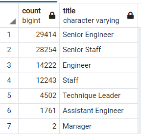

# Pewlett-Hackard-Analysis
## The purpose of this analysis.
  The purpose of this analyis is to identify the number of retiring employess by title, as well as the names of the employees elegible to participate in the Mentorship Program. 

## Results
* 90,398 employees are elegibile for retirement. 
* Of the 90,398, 57,668 or 67.79% are currently employed as a Senior Engineer or Senior Staff.
* 1549 Employees are elegible to particiapte in the Mentorship program.
* Based on the table below we can see that the two largest groups retiring from Pewlett Hackard are senior postions, Senior Engineer, and Senior Staff. 

## Summary
Based off of the findings of my analysis of the current data, Pewlett-Hackard is potentially facing approximately 90,000 vacant positons as staff retire. The amount of employess elegible for mentorship is drastically lower than the amount of vacant postions, and will not be sufficent enough to fill the vacant positions from retirements. To fill every vacancy created by a retirment, 88,849 people will need to be hired. 

